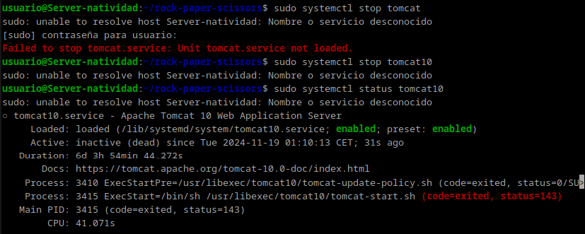
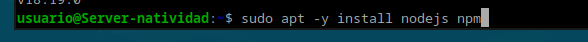
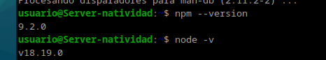
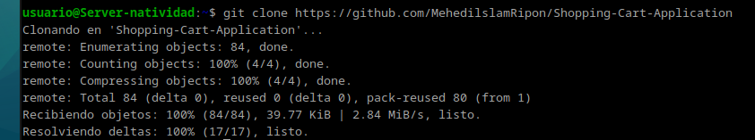
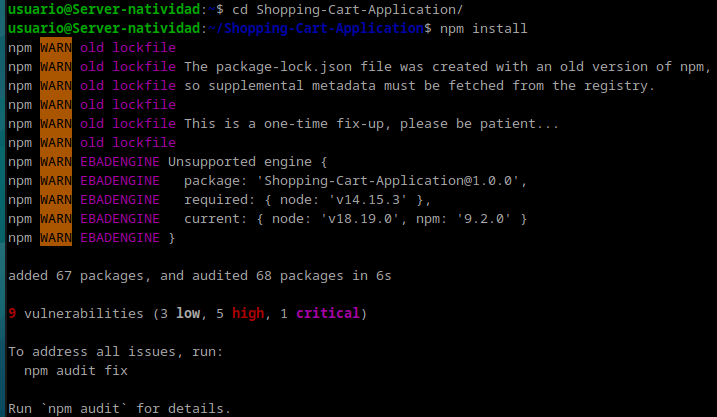
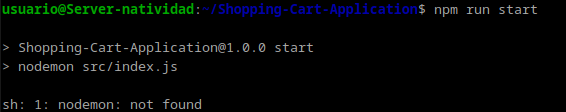
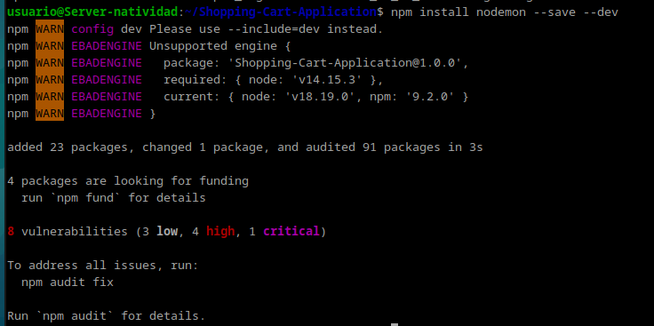
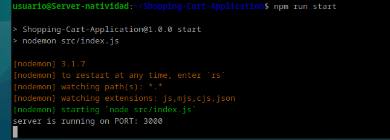
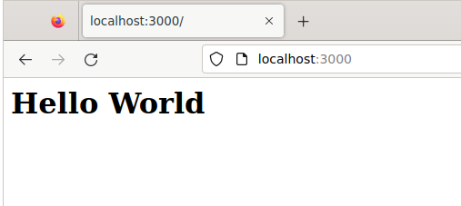

Natividad Márquez Baena

# Práctica 3.2: Despliegue de aplicaciones con Node Express

1. Introducción
2. Instalación de Node.js y Express
3. Test y despliegue de una nueva aplicación

## Introducción

En esta práctica se pretende realizar un despliegue de aplicaciones Node.js sobre un servidor Node Express.
Para ello primero se instala Node.js y Express. Tras ello crear un archivo .js de prueba para comprobar que nuestro el despliegue funciona correctamente.
Luego, en lugar de acceder a `http://localhost:3000`, se accede a la  máquina local a `http://IP-maq-virtual:3000`, utilizando la IP concreta de la máquina virtual.

## Instalación de Node.js

Primeramente y antes de nada, se detendrá el servicio tomcat para poder realizar la práctica.

Depués de eso se instalará node.js

A continuación, se comprueba las versiones instaladas de NodeJS y NPM para verificar si las instalaciones han tenido éxito.

## Test de la primera aplicación y despliegue de una nueva aplicación

Clonamos un repositorio aportado para la práctica, donde obtenemos una aplicación de ejemplo para desplegar y realizar las comprobaciones.

Nos moveremos al directorio y se instalarán las librerías necesarias:

A continuacion iniciamos la aplicación:

Como puede observarse, obtenemos el siguiente error: `sh: 1: nodemon: not found`. Para solucionar dicho error se ejecutará el comando:

Una vez subsanado el error, se vuelve a tratar de inicializar la aplicación:

Finalmente, accedemos a la dirección `http://localhost:3000/`, donde obtendremos la aplicación desplegada:

